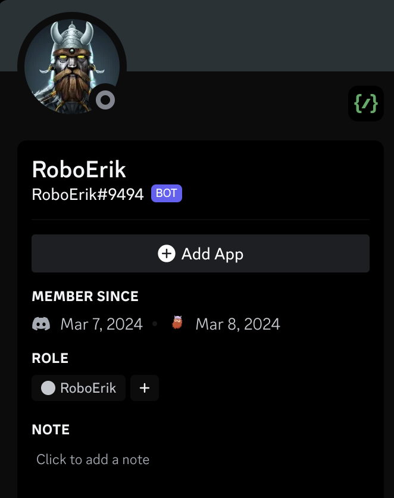
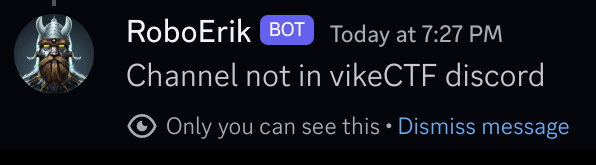
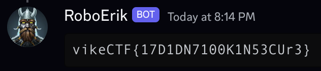

# Robo Erik

**Author: [`MNThomson`](https://github.com/MNThomson/)**

**Category: `Misc Medium`**

## Description

Uh oh! It looks like there's a robot viking in our midst, what power does it have?

> I trust that you'll be able to find a way to join the CTF Discord :p
>
> `RoboErik#9494`

## Organizers

Include both the `bot.py` source code as well as Robo Eriks Discord tag

## Solution

<details>
  <summary><b>TLDR:</b> Spoiler Warning</summary>
    Adding the bot to your own server where you have a role named `Organizer` & opening the discord network tab will show which channels exist in the discord (and which one the bot has access to)
</details>
<br>

### Privesc:

Searching for `from:RoboErik#9494` brings up the bot and we can take a look at its profile.

<p align="center">
  
</p>

There's an `+ Add App` button, so let's add it to our own Discord server! Reading the code, the check for admin is to see if the user has the `Organizer` role.

```python
if "Organizer" not in [r.name for r in ctx.user.roles]:
```

So what happens if we create a role in our own Discord server called `Organizer` and give it to ourselves? Well, now running the command we got passed that check!

<p align="center">
  
</p>

### Hidden Channels

So we can bypass the authorization, but now we need to know what channel to export! We know that it's limited to channels the bot can view in the vikeCTF Discord. None of the channels that are visible to us look interesting so how can we find hidden channels?

In the Discord application, you can open the Chrome Devtools with `CTRL + SHIFT + I` (you might need to [renable them](https://github.com/brunos3d/discord-enable-devtools)). Refreshing the page will show a slew of network requests, but the one we are interested in is on the url `/api/v6/guilds/1065757344459411486/channels`. The response is a massive JSON object containing EVERY channel in the server. Yep, also "hidden" channels. Bingo.

Looking through the JSON, there is a category called "Robo Space" (hmmmmm) and each channel in there has two permissions set....except for `robo-37`. And if we right-click on RoboErik's `RoboErik` role and "copy ID", we also see that the bots ID is `1215764310719070281`

```json
{
  "id": "1215800581189533696",
  "type": 0,
  "last_message_id": "1215823910998642759",
  "flags": 0,
  "guild_id": "1065757344459411486",
  "name": "robo-37",
  "parent_id": "1215799560098676766",
  "rate_limit_per_user": 0,
  "topic": null,
  "position": 59,
  "permission_overwrites": [
    {
      "id": "1065757344459411486",
      "type": "role",
      "allow": 0,
      "deny": 1049600,
      "allow_new": "0",
      "deny_new": "1049600"
    },
    {
      "id": "1215764310719070281",
      "type": "role",
      "allow": 68608,
      "deny": 0,
      "allow_new": "68608",
      "deny_new": "0"
    },
    {
      "id": "1065761359746314280",
      "type": "role",
      "allow": 1049600,
      "deny": 0,
      "allow_new": "1049600",
      "deny_new": "0"
    }
  ],
  "nsfw": false,
  "icon_emoji": {
    "id": null,
    "name": "🤖"
  },
  "theme_color": null
}
```

Looks like RoboErik has some sort of permissions set, so let's run the `/export` command against `robo-37` which is ID `1215800581189533696`. Look, a flag!

<p align="center">
  
</p>

## Flag

```
vikeCTF{17D1DN7100K1N53CUr3}
```
