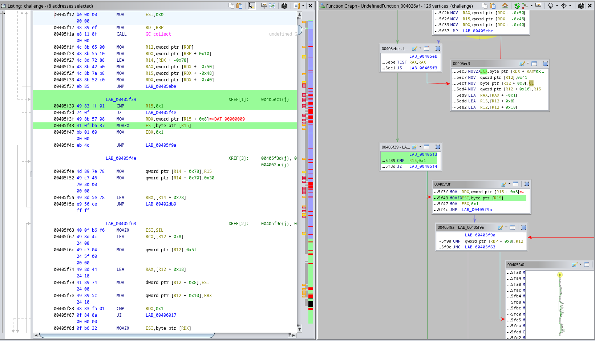
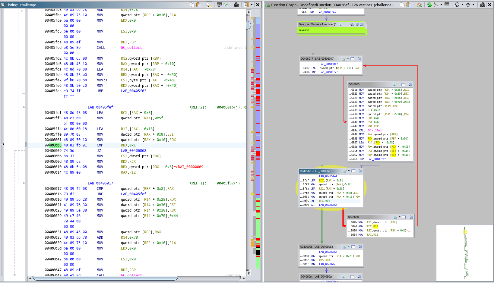

# Cursed

**Author: [`Kyle Stang`](https://github.com/kylestang)**

**Category: `Reverse Hard`**

## Description
Good luck!

## Organizers

Provide just the compiled `cursed` binary file

## Setup

The functions `shift`, `rotate`, and `swap` are the same in `encrypt.py`
and `challenge.sml`. To create the flag array, set the flag value and run
`python encrypt.py`. Then set the output to flag in `challenge.sml`.

Run `build.sh` to compile the binary and give it to the competitors to reverse.

## Solution

**Solution Author: [`Malcolm Seyd`](https://github.com/malcolmseyd)**


We start off by running `file` and `strace`, business as usual.

```console
$ file
challenge: ELF 64-bit LSB executable, x86-64, version 1 (GNU/Linux), statically linked, BuildID[sha1]=f6b8b2d81909fb8e6da702e6a1c056c4dc3409bb, for GNU/Linux 4.4.0, not stripped
$ echo "vikeCTF{whatever}" strace -i ./challenge < flag > /dev/null
... snip ...
[000000000044ac64] write(1, "Enter flag: ", 12Enter flag: ) = 12
[000000000044ab61] read(0, "vikeCTF{whatever}\n", 4096) = 18
[000000000044ac64] write(1, "Wrong!\n", 7) = 7
... snip ...
```

We're basically in the dark about this binary. Time to reverse engineer it!

We open in in Ghirda and we're greeted by a function called "MLton_main". It looks like this is a Standard ML compiler. Interesting! Some googling reveals some info about it, including [a definition](https://github.com/MLton/mlton/blob/master/include/c-main.h#L65-L78) for this main function and a bunch of code describing [the runtime](https://github.com/MLton/mlton/tree/master/runtime).

Let's see if we can figure out how this thing works before we get too deep into reversing. We ask ChatGPT to spit out a basic SML program that adds a constant to a string and reverses it:

```sml
fun main () =
    let
        fun add = Char.chr (Char.ord c + 3)
        val input = valOf (TextIO.inputLine TextIO.stdIn)
        val reversed = String.implode (rev (String.explode input))
        val added = String.map add reversed
    in
        print (added ^ "\n")
    end

val _ = main ()
```

We then compile it with `mlton -codegen c -stop g main.sml` to spit out some C intermediate products for us to analyze. Everything is broken in my IDE so I copy in the contents of `include/` and `runtime/` from the MLton [GitHub repo](https://github.com/MLton/mlton) and take a look.

`main.1.c` just contains some constants like a variable called `staticHeapI` which has a bunch of data like strings, words, and pointers. `main.0.c` contains a bunch of functions with names like `Chunk_5`, which start with a massive jump table. It seems like the program contains a few parts:

* The runtime initializes some memory and then calls the first chunk. It loops through chunks until the program terminates. The program is a sequence of blocks that are jumped between.
* Each chunk has local variables and a collection of blocks, which are jumped to via a jump table at the top of the function.
    * The function signature for a chunk is:
        ```c
        PRIVATE uintptr_t Chunk_9 (UNUSED CPointer GCState, UNUSED CPointer StackTop, UNUSED CPointer Frontier, uintptr_t nextBlock) {
        ```
    * It appears that [Frontier](https://github.com/MLton/mlton/blob/3f761053c682eba903036a23d477a9af4bb8f8c7/mlton/backend/runtime.sig#L25) is part of some heap, [StackTop](https://github.com/MLton/mlton/blob/3f761053c682eba903036a23d477a9af4bb8f8c7/mlton/backend/runtime.sig#L31) is part of some virtual stack, and everything is managed by the garbage collector. It also appears that nextBlock can determine the first block the function should go to when called.
* Each block can jump to either another block, the jump table, or return from the function.
* Inside each block, operations are restricted to:
    * Reading and writing data from either the Chunk (T macro), an object (O macro), or relative to StackTop (S macro)
    * Calling a built-in function
    * Jumping or returning (always at the end of the block)

Having compiled only a 10 line program, I had produced over 7000 lines of C code! This is not going to be easy to reverse, but at least we sort of understand how the program will be structured.

Back in Ghidra, we get ready to analyze the program. Looking through all of the Chunks, most seem trivial except Chunk_8. The C disassembly says:

```c
void Chunk_8(void) {
  long in_RCX;
  
                    /* WARNING: Could not recover jumptable at 0x00401b77. Too many branches */
                    /* WARNING: Treating indirect jump as call */
  (*(code *)(&staticHeapD + *(int *)(frameOffsets3 + in_RCX * 4 + 4)))();
  return;
}
```

Yikes, so the massive jump table at the start of this function is so big that Ghidra refuses to decompile it, and also to disassemble it! I select the mass of undefined memory beneath the jump table with M, Ctrl+Down, M, and press D to dissassemble. I open function graph view and discover that Ghidra shows a different graph depending on which block I open it in. This is too much, I think it's time to crack out the debugger.

I choose to use `rr` with GDB, since if I accidentally step to far I can just step backwards. I also use PwnGDB since I like some of the additions. Note that I think use of `rr` is limited to certain hardware so this may not work for everyone.

```console
$ echo "vikeCTF{HELLOWORLD}" | rr record ./challenge
$ rr replay -x /usr/share/pwndbg/gdbinit.py
GNU gdb (GDB) 14.2
... snip ...
pwndbg>
```

We can start by breaking on the instruction where the program gets our input from the console:

```console
pwndbg> tbreak *0x44ab61
Temporary breakpoint 1 at 0x44ab61
pwndbg> c
Continuing.
Enter flag: 
Temporary breakpoint 1, 0x000000000044ab61 in read ()
... snip ...
pwndbg> reverse-nexti
... snip ...
 ► 0x44ab5f <read+15>    syscall  <SYS_read>
        fd: 0x0
        buf: 0x7aad8cb636b0 ◂— 0x0
        nbytes: 0x1000
... snip ...
```

We step back an instruction (right before the syscall) and see that our input was read to the pointer 0x7aad8cb636b0.

```console
pwndbg> ni
... snip ...
*RAX  0x14
... snip ...
 RSI  0x7aad8cb636b0 ◂— 'vikeCTF{HELLOWORLD}\n'
... snip ...
```

We wrote 20 (0x14) characters, so let's set a watchpoint over that entire region to see what happens to it.

```
pwndbg> rwatch *(char[20]*)0x7aad8cb636b0
Hardware read watchpoint 2: *(char[20]*)0x7aad8cb636b0
pwndbg> c
```

The next few accesses are really boring, it just iterates until it finds the newline at the end.  After that, it moves the memory to a new location. Riveting. Let's move the watchpoint over.

```console
 ► 0x43516a <__memmove_evex_unaligned_erms+106>    vmovdqu xmm1, xmmword ptr [rsi + rdx - 10h]
   0x435170 <__memmove_evex_unaligned_erms+112>    vmovdqu xmmword ptr [rdi], xmm0
   0x435174 <__memmove_evex_unaligned_erms+116>    vmovdqu xmmword ptr [rdi + rdx - 10h], xmm1
   0x43517a <__memmove_evex_unaligned_erms+122>    ret    
pwndbg> ni
pwndbg> ni
... snip ...
 RDI  0x7aad8cb647b8 ◂— 'vikeCTF{HELLOWOR'
... snip ...
pwndbg> ni
... snip ...
 RDI  0x7aad8cb647b8 ◂— 'vikeCTF{HELLOWORLD}\n'
... snip ...
pwndbg> d 2
pwndbg> rwatch *(char[20]*)0x7aad8cb647b8
Hardware read watchpoint 3: *(char[20]*)0x7aad8cb647b8
pwndbg> c
```

It then reads through the entire string backwards and then never looks at it again. I suppose we should check that out.

```console
 ► 0x405ec3 <Chunk_8+17269>    movzx  ecx, byte ptr [rdx + rax]
   0x405ec7 <Chunk_8+17273>    mov    qword ptr [r12], 41h
   0x405ecf <Chunk_8+17281>    mov    byte ptr [r12 + 8], cl
   0x405ed4 <Chunk_8+17286>    mov    qword ptr [r12 + 10h], r15
   0x405ed9 <Chunk_8+17291>    lea    rax, [rax - 1]
   0x405edd <Chunk_8+17295>    lea    r15, [r12 + 8]
   0x405ee2 <Chunk_8+17300>    lea    r12, [r12 + 18h]
   0x405ee7 <Chunk_8+17305>    cmp    qword ptr [rbp + 8], r12
   0x405eeb <Chunk_8+17309>    jae    405ebeh                       <Chunk_8+17264>
```

It looks like we're reading from the string (RDX) with an index (RAX) into RCX. We then write 0x41, RCX, and R15 into R12. We then decrease RAX by 1, set R15 to point to the character we just wrote memory, and then bump R12 past where we last wrote. This sure looks like R12 might be StackTop from earlier.

So basically, it's building a singly linked list out of the string and writing it all to the "stack". We can't use the built-in stack view so let's use pwndbg's `telescope` command instead. We use Ghidra's Function Graph view to find the first address after the loop breaks and peek at the stack:

```console
pwndbg> tbreak *0x405f39
Temporary breakpoint 4 at 0x405f39
pwndbg> c
Continuing.

Temporary breakpoint 4, 0x0000000000405f39 in Chunk_8 ()
... snip ...
pwndbg> telescope r12-8*3*20 3*20
00:0000│     0x7aad8cb647e8 ◂— 0x41 /* 'A' */
01:0008│     0x7aad8cb647f0 ◂— 0xa /* '\n' */
02:0010│     0x7aad8cb647f8 ◂— 0x1
03:0018│     0x7aad8cb64800 ◂— 0x41 /* 'A' */
04:0020│     0x7aad8cb64808 ◂— 0x7d /* '}' */
05:0028│     0x7aad8cb64810 —▸ 0x7aad8cb647f0 ◂— 0xa /* '\n' */
06:0030│     0x7aad8cb64818 ◂— 0x41 /* 'A' */
07:0038│     0x7aad8cb64820 ◂— 0x44 /* 'D' */
08:0040│     0x7aad8cb64828 —▸ 0x7aad8cb64808 ◂— 0x7d /* '}' */
09:0048│     0x7aad8cb64830 ◂— 0x41 /* 'A' */
0a:0050│     0x7aad8cb64838 ◂— 0x4c /* 'L' */
0b:0058│     0x7aad8cb64840 —▸ 0x7aad8cb64820 ◂— 0x44 /* 'D' */
0c:0060│     0x7aad8cb64848 ◂— 0x41 /* 'A' */
0d:0068│     0x7aad8cb64850 ◂— 0x52 /* 'R' */
0e:0070│     0x7aad8cb64858 —▸ 0x7aad8cb64838 ◂— 0x4c /* 'L' */
0f:0078│     0x7aad8cb64860 ◂— 0x41 /* 'A' */
10:0080│     0x7aad8cb64868 ◂— 0x4f /* 'O' */
11:0088│     0x7aad8cb64870 —▸ 0x7aad8cb64850 ◂— 0x52 /* 'R' */
12:0090│     0x7aad8cb64878 ◂— 0x41 /* 'A' */
13:0098│     0x7aad8cb64880 ◂— 0x57 /* 'W' */
14:00a0│     0x7aad8cb64888 —▸ 0x7aad8cb64868 ◂— 0x4f /* 'O' */
15:00a8│     0x7aad8cb64890 ◂— 0x41 /* 'A' */
16:00b0│     0x7aad8cb64898 ◂— 0x4f /* 'O' */
17:00b8│     0x7aad8cb648a0 —▸ 0x7aad8cb64880 ◂— 0x57 /* 'W' */
18:00c0│     0x7aad8cb648a8 ◂— 0x41 /* 'A' */
19:00c8│     0x7aad8cb648b0 ◂— 0x4c /* 'L' */
1a:00d0│     0x7aad8cb648b8 —▸ 0x7aad8cb64898 ◂— 0x4f /* 'O' */
1b:00d8│     0x7aad8cb648c0 ◂— 0x41 /* 'A' */
1c:00e0│     0x7aad8cb648c8 ◂— 0x4c /* 'L' */
1d:00e8│     0x7aad8cb648d0 —▸ 0x7aad8cb648b0 ◂— 0x4c /* 'L' */
1e:00f0│     0x7aad8cb648d8 ◂— 0x41 /* 'A' */
1f:00f8│     0x7aad8cb648e0 ◂— 0x45 /* 'E' */
20:0100│     0x7aad8cb648e8 —▸ 0x7aad8cb648c8 ◂— 0x4c /* 'L' */
21:0108│     0x7aad8cb648f0 ◂— 0x41 /* 'A' */
22:0110│     0x7aad8cb648f8 ◂— 0x48 /* 'H' */
23:0118│     0x7aad8cb64900 —▸ 0x7aad8cb648e0 ◂— 0x45 /* 'E' */
24:0120│     0x7aad8cb64908 ◂— 0x41 /* 'A' */
25:0128│     0x7aad8cb64910 ◂— 0x7b /* '{' */
26:0130│     0x7aad8cb64918 —▸ 0x7aad8cb648f8 ◂— 0x48 /* 'H' */
27:0138│     0x7aad8cb64920 ◂— 0x41 /* 'A' */
28:0140│     0x7aad8cb64928 ◂— 0x46 /* 'F' */
29:0148│     0x7aad8cb64930 —▸ 0x7aad8cb64910 ◂— 0x7b /* '{' */
2a:0150│     0x7aad8cb64938 ◂— 0x41 /* 'A' */
2b:0158│     0x7aad8cb64940 ◂— 0x54 /* 'T' */
2c:0160│     0x7aad8cb64948 —▸ 0x7aad8cb64928 ◂— 0x46 /* 'F' */
2d:0168│     0x7aad8cb64950 ◂— 0x41 /* 'A' */
2e:0170│     0x7aad8cb64958 ◂— 0x43 /* 'C' */
2f:0178│     0x7aad8cb64960 —▸ 0x7aad8cb64940 ◂— 0x54 /* 'T' */
30:0180│     0x7aad8cb64968 ◂— 0x41 /* 'A' */
31:0188│     0x7aad8cb64970 ◂— 0x65 /* 'e' */
32:0190│     0x7aad8cb64978 —▸ 0x7aad8cb64958 ◂— 0x43 /* 'C' */
33:0198│     0x7aad8cb64980 ◂— 0x41 /* 'A' */
34:01a0│     0x7aad8cb64988 ◂— 0x6b /* 'k' */
35:01a8│     0x7aad8cb64990 —▸ 0x7aad8cb64970 ◂— 0x65 /* 'e' */
36:01b0│     0x7aad8cb64998 ◂— 0x41 /* 'A' */
37:01b8│     0x7aad8cb649a0 ◂— 0x69 /* 'i' */
38:01c0│     0x7aad8cb649a8 —▸ 0x7aad8cb64988 ◂— 0x6b /* 'k' */
39:01c8│     0x7aad8cb649b0 ◂— 0x41 /* 'A' */
3a:01d0│ r15 0x7aad8cb649b8 ◂— 0x76 /* 'v' */
3b:01d8│     0x7aad8cb649c0 —▸ 0x7aad8cb649a0 ◂— 0x69 /* 'i' */
```

There's the linked list! Let's watch the head and keep going.

```console
pwndbg> rwatch *(char*)0x7aad8cb649b8
Hardware read watchpoint 5: *(char*)0x7aad8cb649b8
pwndbg> c
Continuing.

Hardware read watchpoint 5: *(char*)0x7aad8cb649b8

Value = 118 'v'
... snip ...
```

Aaaaand it breaks pretty much immediately. We literally just jumped from the first green line to the second.



Let's step through the loop and look at the stack.

```console
pwndbg> d 5
pwndbg> b *0x405f83
Breakpoint 6 at 0x405f83
pwndbg> c
Continuing.
pwndbg> c
Continuing.
... snip a bunch of continues ...
pwndbg> c
Continuing.
Wrong!

Program received signal SIGKILL, Killed.
pwndbg> reverse-cont
Continuing.
Wrong!

Breakpoint 6, 0x0000000000405f83 in Chunk_8 ()
pwndbg> telescope r12-8*3*20 3*20
... snip ...
2a:0150│     0x7aad8cb64b00 ◂— 0x5f /* '_' */
2b:0158│     0x7aad8cb64b08 ◂— 0x57 /* 'W' */
2c:0160│     0x7aad8cb64b10 —▸ 0x7aad8cb64af0 ◂— 0x4f /* 'O' */
2d:0168│     0x7aad8cb64b18 ◂— 0x5f /* '_' */
2e:0170│     0x7aad8cb64b20 ◂— 0x4f /* 'O' */
2f:0178│     0x7aad8cb64b28 —▸ 0x7aad8cb64b08 ◂— 0x57 /* 'W' */
30:0180│     0x7aad8cb64b30 ◂— 0x5f /* '_' */
31:0188│     0x7aad8cb64b38 ◂— 0x52 /* 'R' */
32:0190│     0x7aad8cb64b40 —▸ 0x7aad8cb64b20 ◂— 0x4f /* 'O' */
33:0198│     0x7aad8cb64b48 ◂— 0x5f /* '_' */
34:01a0│     0x7aad8cb64b50 ◂— 0x4c /* 'L' */
35:01a8│     0x7aad8cb64b58 —▸ 0x7aad8cb64b38 ◂— 0x52 /* 'R' */
36:01b0│     0x7aad8cb64b60 ◂— 0x5f /* '_' */
37:01b8│     0x7aad8cb64b68 ◂— 0x44 /* 'D' */
38:01c0│     0x7aad8cb64b70 —▸ 0x7aad8cb64b50 ◂— 0x4c /* 'L' */
39:01c8│     0x7aad8cb64b78 ◂— 0x5f /* '_' */
3a:01d0│ rbx 0x7aad8cb64b80 ◂— 0x7d /* '}' */
3b:01d8│     0x7aad8cb64b88 —▸ 0x7aad8cb64b68 ◂— 0x44 /* 'D' */
```

We can use rr's reverse-cont to safely go backwards if we overshoot the loop :). It looks like it just reversed the string, stripping off the \n at the end. Let's step through the next loop. Btw, I'm just picking addresses from the Ghidra graph view, usually at the comparison that decides if the loop breaks or continues.




Let's keep going through these loops. I think you get the idea. Find a good branch to break at. Continue until the loop breaks. Inspect the stack. Rinse. Repeat. Or just select an address after the loop if you don't want to inspect as it goes, whatever floats your boat.


Lots more reversing and unreversing happens, I'll spare you the details, but if you're curious, this is just what happens in purely functional languages that use linked lists. Here's the implementation of [List.map](https://github.com/MLton/mlton/blob/3f761053c682eba903036a23d477a9af4bb8f8c7/lib/mlton/basic/list.sml#L175) if you're not convinced, there's two reverses.

The next three loops reverse, subtract 13, and then reverse again. After this the stack contains a linked list spelling out `i\^X6G9n;8??BJBE?7p`

We then end up in a loop that copies the entire list over to RBX in pairs, delimited by 0xe. Cool.

I keep stepping and eventually end up back at the jump table (0x401b77). It looks like R12 was cleared, but our stuff is still at RBX.

We jump to a very small block (0x401b95) that just takes the top two elements off of RBX, swaps them, and puts them back onto R12. If we set the jump table as a breakpoint and loop, we eventually get this list on the stack: `\iX^G6n98;??JBEB7?p`

Let's keep our breakpoint on the jump table and continue, skipping the next block (0x4025ef). We got two new lists this time: `B`, and `EB7?p\iX^G6n98;??JB`. The second one was a bit tangled, I had to chase a pointer at the first `\` to properly follow it. It looks like it took the last 5 characters from the end and put them on the front, like a rotate right function.

Let's keep continuing at the jump table. We swap stuff again, and end up with `BE?7\pXiG^n689?;J?B`

We continue again and end up with some strange list on the stack that I can't make sense of. We back up one reverse-cont and step into the block (0x40252f).

After some stepping, we discover at 0x40587f that our list has been rotated right by 3 this time, giving us `J?BBE?7\pXiG^n689?;`.

We keep stepping until we go wayyy back up to 0x40570e, and the list is now `|qttwqi\x8e\xa2\x8a\x9by\x90\xa0hjkqm`. The loop at 0x40589f was adding 50 (0x32).

We're soon booted back to the main loop jump table. The next block pretty much immediately decides to give me a string that says "Wrong!", so I think something important happened inside the end of the last block. I go back to 0x40570e in the previous block and step a little more carefully.

Literally one instruction after the break (0x405715), we notice a load from the staticHeapI (0x4ca238), which is new to me. It ends up on RBX, and then it looks like it compares with our list. I have a hunch that this is the flag. Right after the comparison fails (0x402cb5) it boots us directly to the jump table, where it promply says "Wrong!".

Let's pull that flag out! We open it up in Ghidra and define a type (dword, pointer), and apply it to the address. We can then repeatedly press Y to apply the data type and click the pointer to go to the next element. Many iterations later, we have the flag defined as a linked list.

Okay, so we have a series of transformations, and we have a flag. Let's write a solver! To recap, the steps were:

- Subtract 13
- Swap adjacent pairs
- Rotate right by 5
- Swap adjacent pairs
- Rotate right by 3
- Add 50

None of the characters in the flag are below 50, so this should be reversable. Let's go!

```py
import itertools as it


def rotate_left(xs: list[int], n: int):
    return xs[n:] + xs[:n]


def swap(xs: list[int]):
    out = []
    for t in it.batched(xs, 2):
        if len(t) < 2:
            out += t
        else:
            a, b = t
            out += b, a
    return out


flag = [
    0x69, 0x73, 0x84, 0x69, 0x55, 0xA2, 0x66, 0x8E, 0x5A, 0x8A, 0x9B, 0x79,
    0x90, 0xA0, 0x68, 0x72, 0x6B, 0x7A, 0x56, 0x59, 0x72, 0x71, 0x79, 0x84,
    0x67, 0x59, 0x58, 0x58, 0x71, 0x66, 0x72, 0x72,
]


flag = list(map(lambda x: x - 50, flag))
flag = rotate_left(flag, 3)
flag = swap(flag)
flag = rotate_left(flag, 5)
flag = swap(flag)
flag = list(map(lambda x: x + 13, flag))

print("".join(chr(c) for c in flag))
```

Drum roll please... The flag is:

```
$ python solve.py
vikeCTF{1MMUT4BL3_L4M3DA_M0NAD5}
```

## Flag

```
vikeCTF{1MMUT4BL3_L4M3DA_M0NAD5}
```
