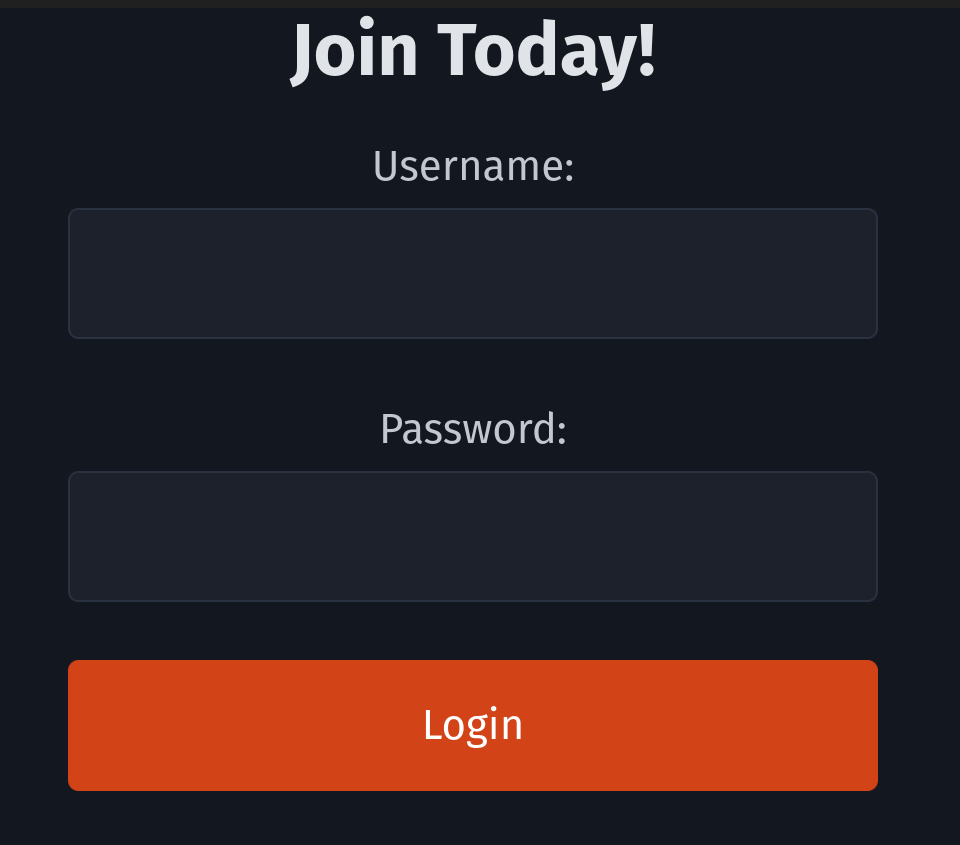
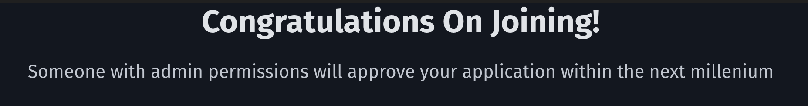
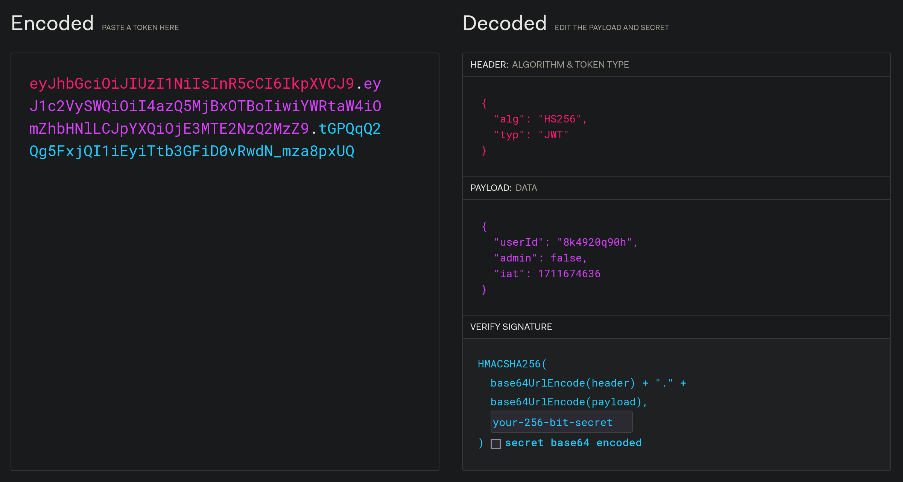
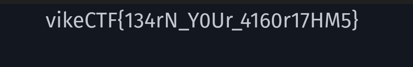

# Jarls Weakened Trust

**Author: [`MNThomson`](https://github.com/MNThomson/)**

**Category: `Web Easy`**

## Description

Jarl's been bragging about becoming an admin on the new axe sharing network. Can you?

## Solution

<details>
  <summary><b>TLDR:</b> Spoiler Warning</summary>
    The website is vulnerable to a JWT Algorithm is None attack
</details>
<br>

When we navigate to the homepage of the challenge, we're greeted with a "Join Today!" form.

<p align="center">
  
</p>

Providing any data to the form input and clicking the "Login" button, brings us to a new page.

<p align="center">
  
</p>

Now that sounds suspiciously like an XSS when an admin visits the page, maybe something to think about after we finish our initial recon.

One thing that's weird, is you'll notice we are still on the home page at `/`. But before before we "joined", it was also on `/`, meaning there is some sort of session stored on client side. If we use the "clear all cookies and site data" that most browsers provide, after refreshing we end up back on the page that says "Join Today!". So there is a persistent session!

Looking through the cookies, there is only one and it's called `AUTHORIZATION`. Now that looks interesting. The value of the cookie is `eyJhbGciOiJIUzI1NiIsInR5cCI6IkpXVCJ9.eyJ1c2.....` which looks like a [JWT token](https://jwt.io/). Viewing the jwt on [jwt.io](https://jwt.io) shows us some interesting information.

<p align="center">
  
</p>

So it's a JWT token that containsthe field `admin: false`. Clearly we want to switch to `admin: true` but doing so will change the value of the token and no longer match the signature. If we do true that, we just get punted back to the "Join Today!" page and it looks like our cookie got removed `:(`.

A quick search for "JWT Vulnerability" brings us to [HackTricks](https://book.hacktricks.xyz/pentesting-web/hacking-jwt-json-web-tokens) (which is an awesome resource btw). Going down the list, [this one](https://book.hacktricks.xyz/pentesting-web/hacking-jwt-json-web-tokens#modify-the-algorithm-to-none-cve-2015-9235) seems interesting. So if we set the `alg` in the header to `none` and remove the signature, apparently the JWT is considered valid.

You can do this manually through the [jwt.io](https://jwt.io) ui or just search for "JWT alg none exploit" and [this website](https://www.gavinjl.me/edit-jwt-online-alg-none/) comes up. After setting the `alg` to `none` and `admin: true`, we can edit our `AUTHORIZATION` cookie with the new value.

When we refresh the page, we are given the flag!

<p align="center">
  
</p>

## Flag

```
vikeCTF{134rN_Y0Ur_4160r17HM5}
```
