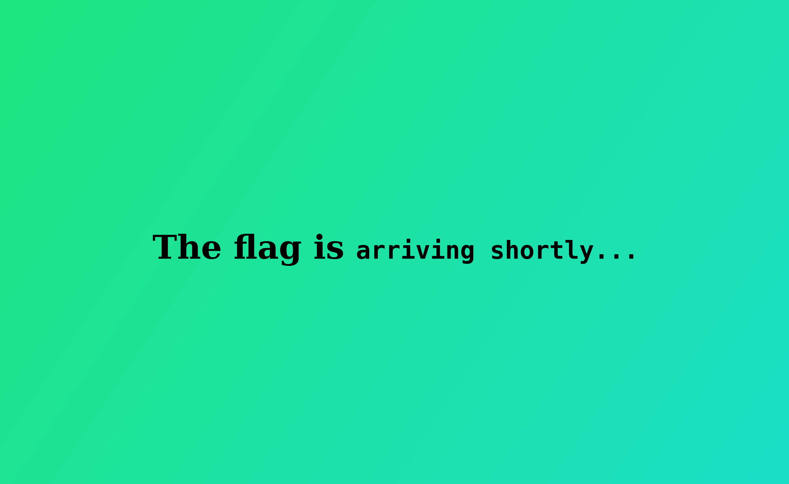

# Ponies

**Author: [`MNThomson`](https://github.com/MNThomson)**

**Category: `Easy Web`**

## Description

OH NO, where did all these ponies come from??? Quick, get the flag and sail away before we are overrun!

## Solution

<details>
  <summary><b>TLDR:</b> Spoiler Warning</summary>
    Using `curl` will provide the page source, just read it!
</details>
<br>

Loading the page seems promising with the `flag arriving shortly...` but then the ponies appear! Oh no!

<p align="center">
  
  
</p>

It looks like the flag is going to appear but my laptop fans are heating up. So instead let's just `curl` the page source.

```js
...SNIP...
function recursiveSpawn() {
    BrowserPonies.spawnRandom(incrementalPonies);
    if (!BrowserPonies.running()) {
        counter = counter + 1;
        document.getElementById("flag").innerHTML = "arriving shortly" + ".".repeat(counter % 4);
        setTimeout(recursiveSpawn, intervalMs);
    } else {
        setTimeout(() => {
            var tag = document.createElement("script");
            tag.src = "/gag.js";
            document.getElementsByTagName("head")[0].appendChild(tag);
        }, "7000");
    }
}
recursiveSpawn();
...SNIP...
```

Reading the above source code, it appears that after the ponies have loaded, a `<script>` tag is added to the head with a source of `/gag.js`. So lets see whats in that file!

```console
$ curl http://PONIES_URL/gag.js
document.getElementById("flag").innerHTML = "vikeCTF{ponies_for_life}";
```

Well now, that looks like a flag. Remember there are more ways to view a website than just graphically.

## Flag

```
vikeCTF{ponies_for_life}
```
